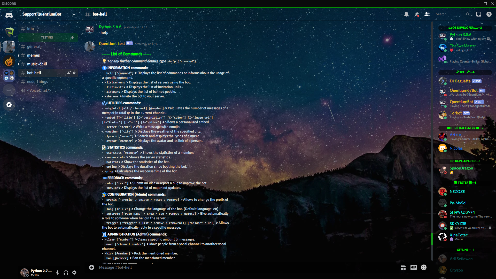
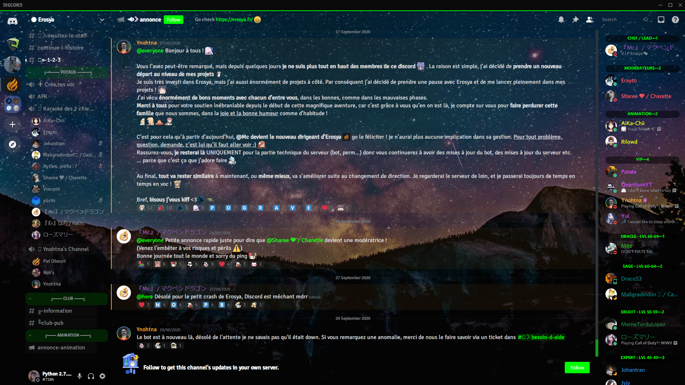
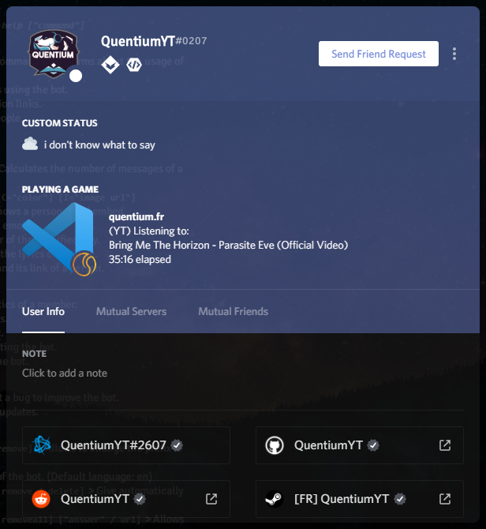

# SubstantialSpace

SubstantialSpace theme for BetterDiscord

#### [Download the theme here](https://raw.githubusercontent.com/QuentiumYT/SubstantialSpace/main/SubstantialSpace.theme.css)

A small theme I've been working on for a while and finally decided to release it :)

### Customizations

You can change different things like background and colors:

-   Background: url to a static PNG / JPEG / GIF file
-   Transparency: color with an alpha channel
-   Main color: color with no transparency
-   Middle color: main color with half transparency
-   Darker color: main color darker and lower transparency

_Discord dark theme is required!_

Simple view with a small server

Bigger server with announcements channel and several details

User profile

